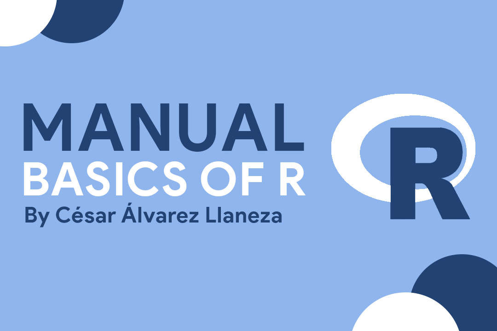
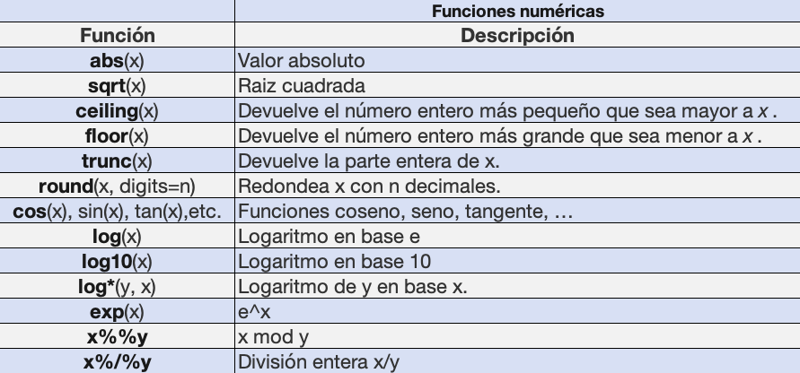
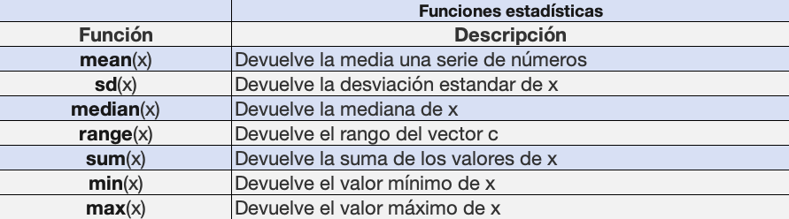
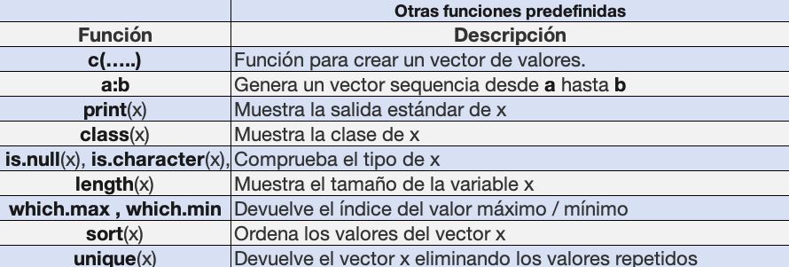

# R-Manual



R es un entorno y lenguaje de programación con un enfoque al análisis estadístico. R nació como una reimplementación de software libre del lenguaje S.

## Primer “Hola Mundo” en R
En todo lenguaje de programación lo primero que se aprende es escribir nuestro primer “Hola Mundo”. En R este se inscribe utilizando la función ‘print()’ y dentro de los paréntesis escribimos con comillas el texto que queremos visualizar.

```r
print("Hola Mundo")
```


## Estructura del lenguaje
R nos permite asignar valores a diferentes atributos y poder hacer  operaciones con estos. En el ejemplo siguiente asignaremos el valor de 4 a ‘a’ y de 5 a ‘b’. Para luego sumarlos y asignar ese valor a c. El resultado de c lo visualizaremos en la consola (9):

```r
a = 4
b = 5
c = a + b
print(c)
```


El uso de las llaves ‘{}’ no es necesario si queremos lanzar una única instrucción.
```r
if(a == 2)
  print("Hola Mundo")
  print("Sí es un dos")
```


En el caso de querer lanzar más de una instrucción, sí son necesidad las llaves ‘{}’
```r
if(a == 2) {
  print("Hola Mundo")
  print("Sí es un dos")
} else {
  print("Hola Mundo, no es dos")
}
```


El punto y coma, no es obligatorio si escribimos una instrucción por línea. Del mismo modo, sí lo es si queremos escribir varias instrucciones por linea.
```r
# Error
print("Hola") print("Adios")
# Ok
print("Hola"); print("Adios")
```


## Trabajar con Variables

Por defecto, el asignador en R es la función *<-* o *->*. También se puede realizar la asignación con el signo *=*:
```r
 a <- 4
 3 -> b
 a
[1] 4
 b
[1] 3
 c = 5
 c
[1] 5
```

También, podemos realizar la asignación mediante la función *assign* o asignar un valor resultado:
```r
> assign("x", "hola")
> x
[1] "hola"

# Podemos asignar el valor de un resultado
> a
[1] 4
> b
[1] 3
> y = a > b
> y
[1] TRUE
> z = a + b
> z
[1] 7

# La función ifelse(x,y,z) devuelve el valor y si la condición x es TRUE o z si x = FALSE
> mayor = ifelse(a > b , a , b)
> mayor
[1] 4
```


Las variables se irán guardando en memoria conforme se vayan creando. Podemos recuperar un listado de todas variables con la función *objects* o *ls*
```r
> objects()
 [1] "a"            "b"            "c"            "x"       "z"  "mayor" 
> ls()
 [1] "a"            "b"            "c"            "x"       "z"  "mayor" 

# Con la función object.size podemos recuperar el tamaño de una variable
> x
[1] "hola"
> object.size(x)
96 bytes
```


También podemos eliminar variables.
```r
> remove(a)
> a
Error: object 'a' not found
> objects()
 [1] "b"            "c"            "x"       "z"  "mayor"
```

La función *save.image* nos permite guardar todas las variables que tenemos en memoria. Con la función *load* podemos cargar dichas variables.
```r
> save.image(file = "variables.RData")
> remove(list = ls())
> ls()
character(0)
> objects()
character(0)
> load(file = "variables.RData")
> ls()
[1] "a"     "b"     "c"     "mayor" "x"
```
## Funciones predefinidas









